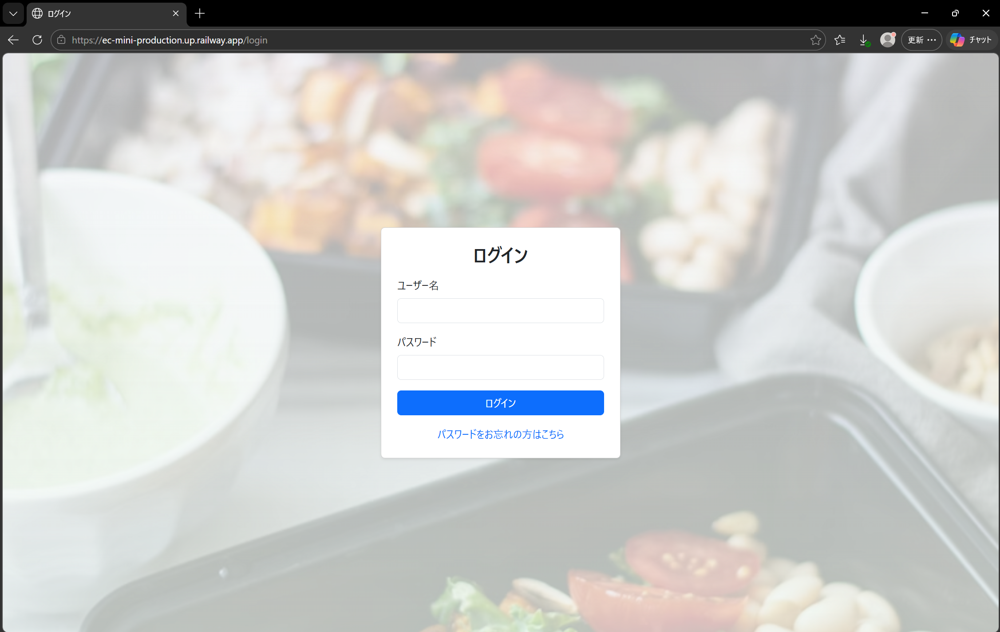
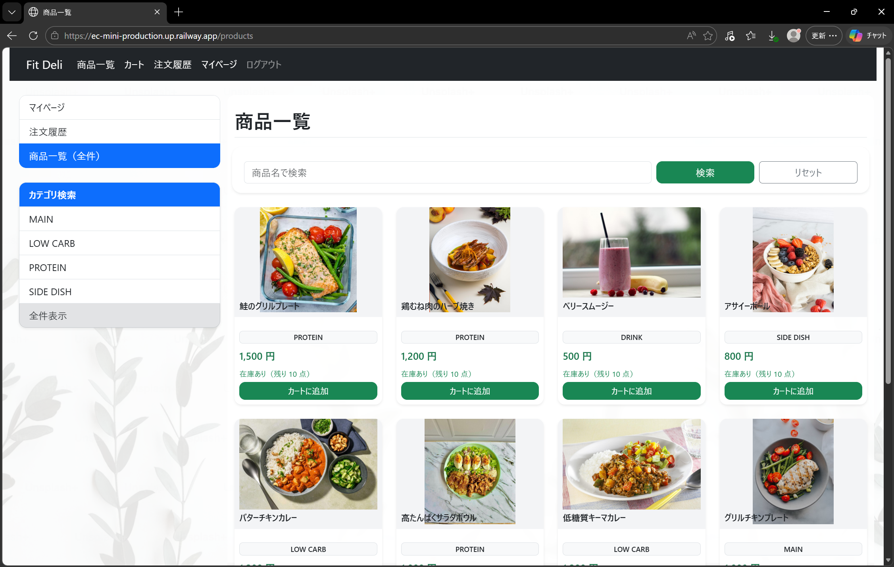
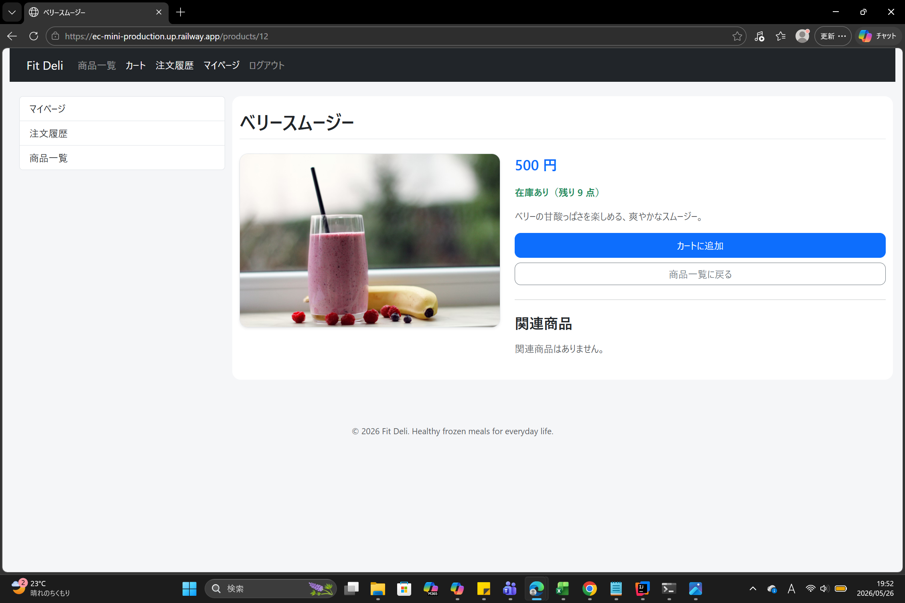
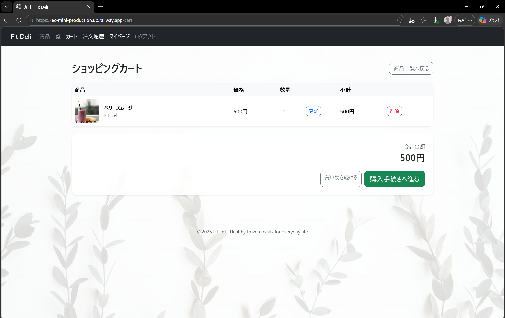
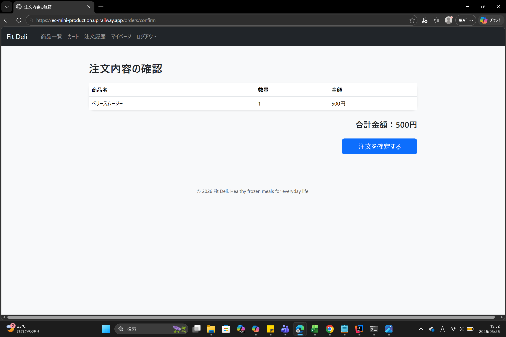
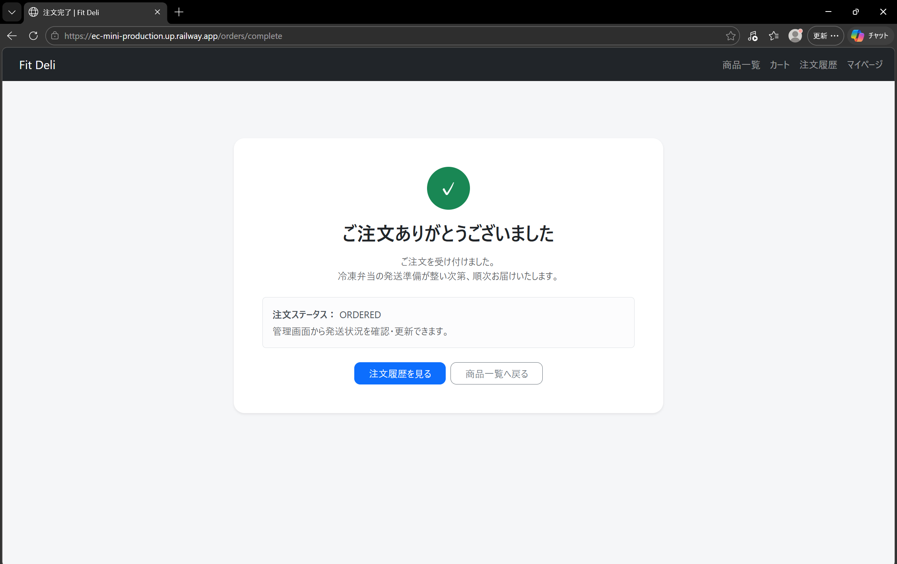

# Fit Deli

Healthy frozen meals for everyday life.

---

## アプリ概要

Fit Deli は、健康志向ユーザー向けの冷凍宅配弁当 EC サイトです。

ユーザーは商品閲覧、カート追加、注文、注文履歴確認を行うことができます。

Spring Boot を用いてバックエンドを構築し、Railway にデプロイしています。

---

## 使用技術

- Java 17
- Spring Boot
- Spring Security
- Thymeleaf
- Bootstrap 5
- MySQL
- Railway
- GitHub

---

## 主な機能

### ユーザー側

- ログイン / ログアウト
- 商品一覧表示
- 商品詳細表示
- カート機能
- 注文機能
- 注文履歴表示
- マイページ

### 管理者側

- 商品管理
- 注文管理
- 注文ステータス更新
- ダッシュボード表示

---

## 画面イメージ

### ログイン画面


### 商品一覧画面


### 商品詳細画面


### カート画面


### 注文確認画面


### 注文完了画面


---

## 工夫した点

- Shopify風の食品ECデザインを意識し、UIを統一
- 商品画像・カードUI・注文導線を改善
- レスポンシブ対応を意識してBootstrapで実装
- 注文ステータスと管理画面を連動

---

## 設計・実装で意識した点

- Controller / Service / Repository の責務分離
- Entityを画面入力に直接使用せず、ProductFormを用いたDTO設計
- Bean Validationによる入力チェック
- BindingResultを用いたフォームエラー制御
- GlobalExceptionHandlerによる例外処理の共通化
- ProductNotFoundExceptionによる独自例外の定義
- application-secret.propertiesによる機密情報の分離
- 商品登録・更新処理の共通化による重複コード削減

---

## 苦労した点

- レイアウト共通化時に循環参照が発生し、画面構成の見直しを行った
- 商品画像のパス管理と静的リソース構成の調整
- Thymeleaf のテンプレート構造整理
- Railway デプロイ時の Docker / branch 管理

---

## URL

### アプリ
https://ec-mini-production.up.railway.app/

### GitHub
https://github.com/YOSHI110YY/ec-mini

---

## テストアカウント

### 一般ユーザー
ID: testuser

PASS: password

### 管理者
ID: admin　　

PASS: passoword

---

## 起動方法

### 必要環境

- Java 17
- MySQL 8

### 起動手順

```bash
git clone https://github.com/YOSHI110YY/ec-mini.git
```

```bash
cd ec-mini
```

```bash
mvn spring-boot:run
```

---

## 今後改善したい点

- 決済機能の追加
- お気に入り機能
- 商品レビュー機能
- Docker対応

---

本アプリは、Java / Spring Boot の学習を目的として開発しました。

今後も機能追加・UI改善を継続予定です。
