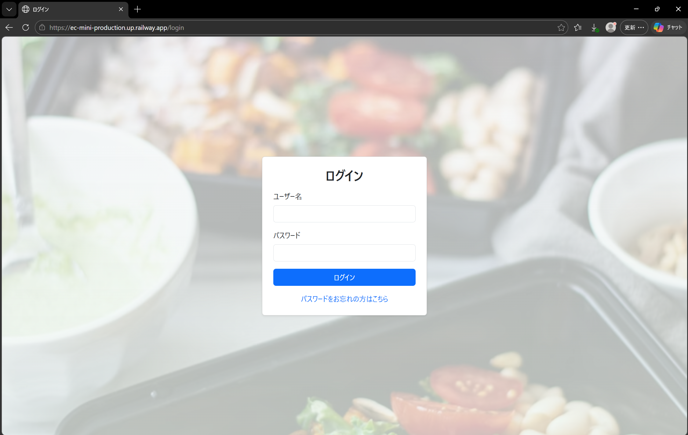
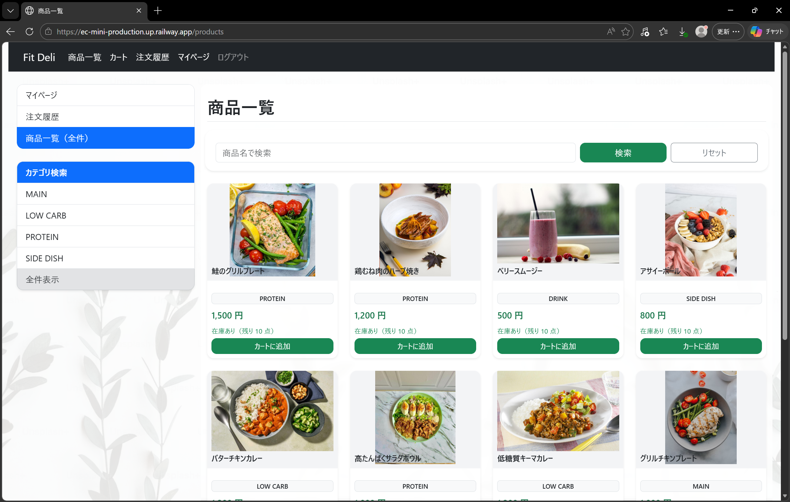
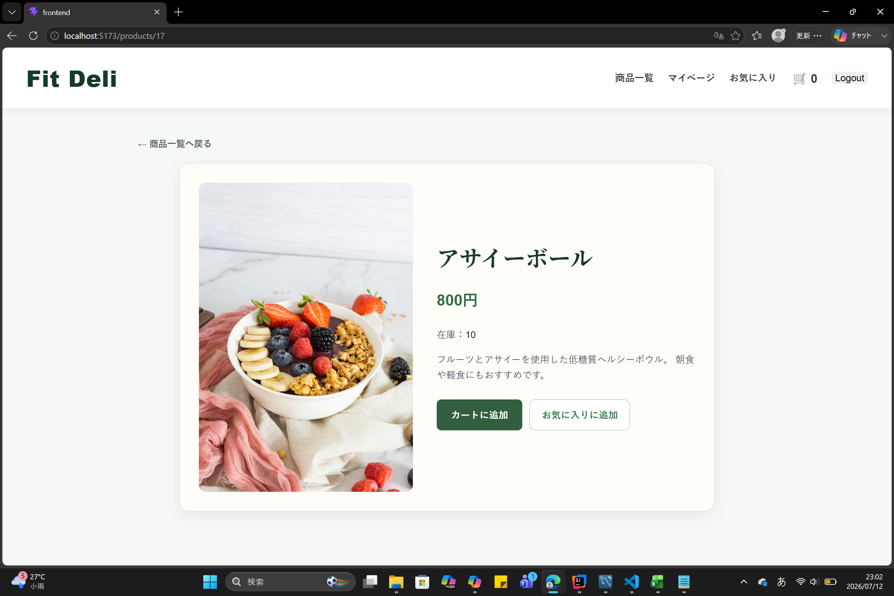
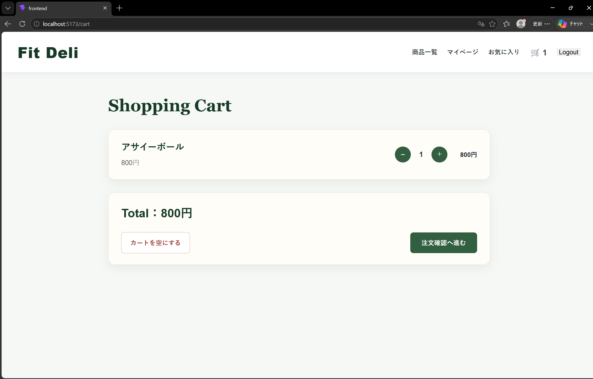
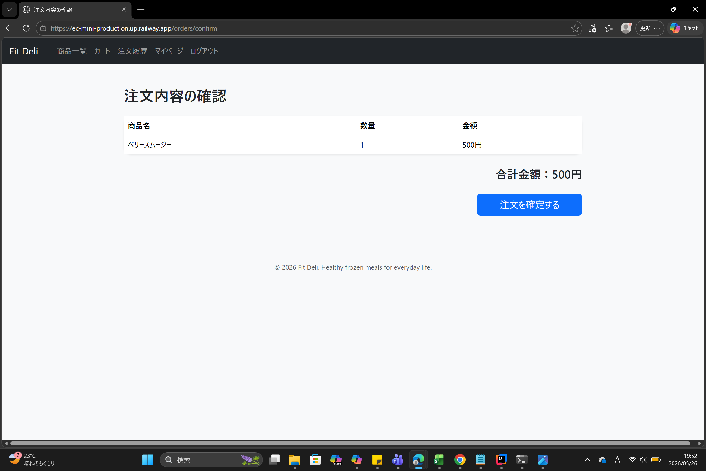
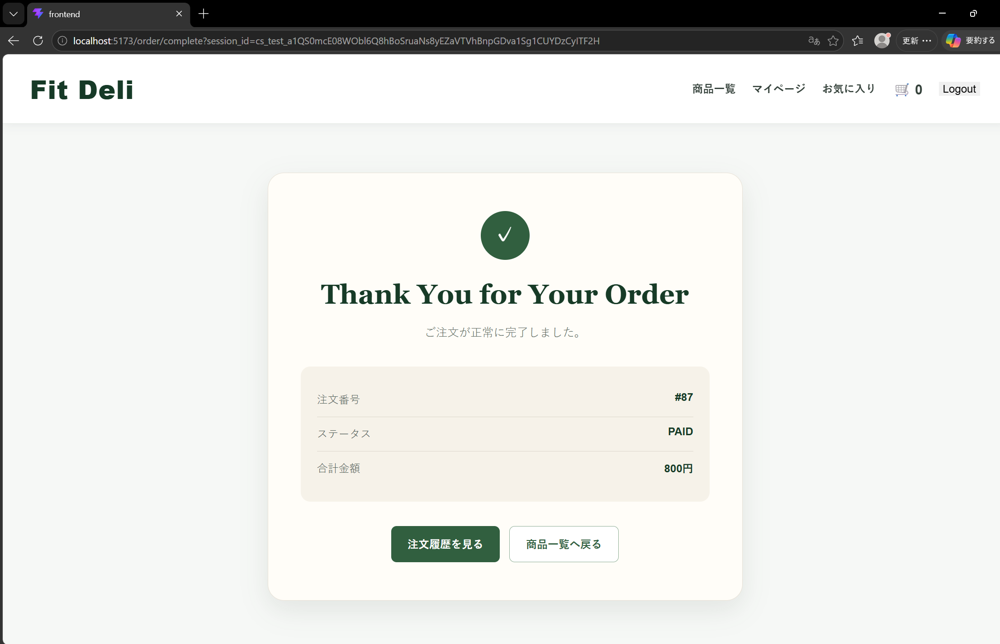
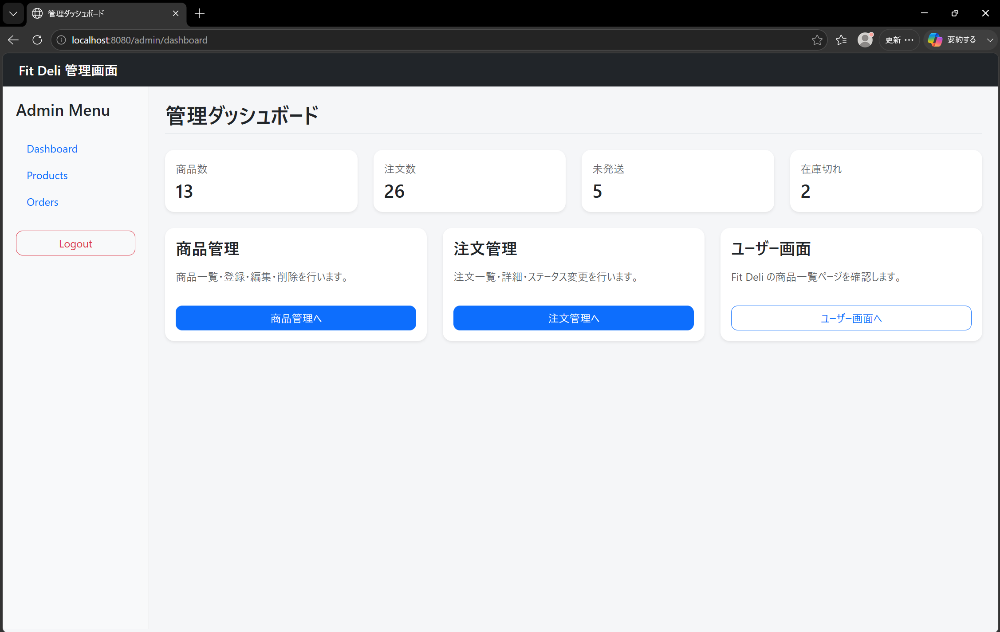
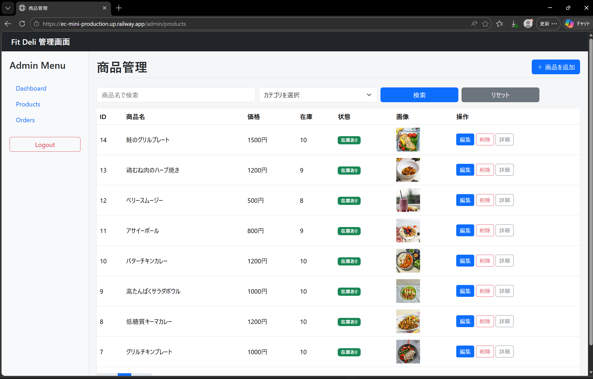
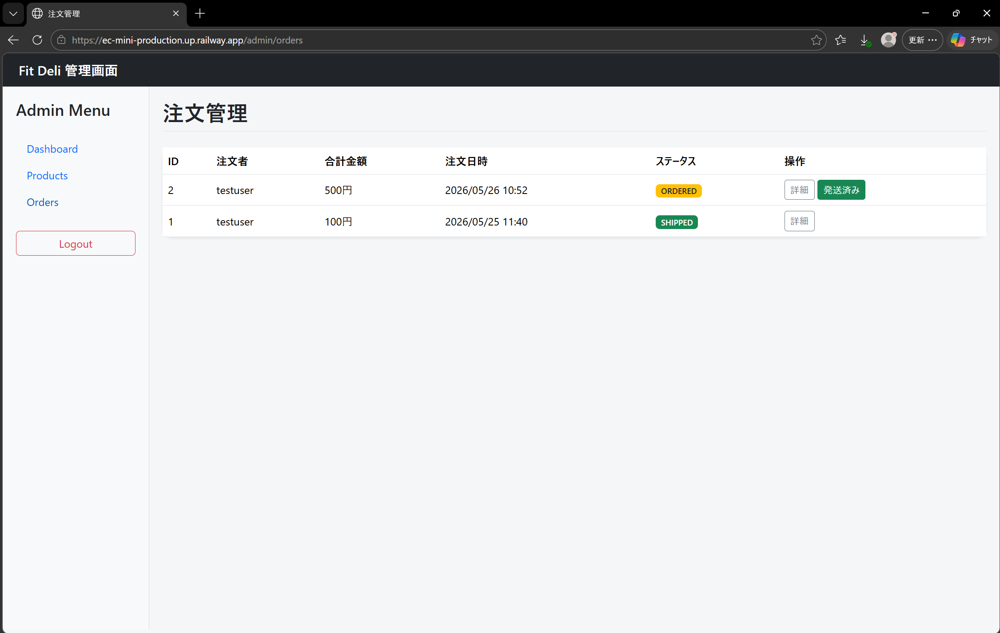

# Fit Deli

Healthy frozen meals for everyday life.


---

## Demo

- App: https://ec-mini-production.up.railway.app/
- GitHub: https://github.com/YOSHI110YY/ec-mini

---

## テストアカウント

※ ポートフォリオ確認用の簡易アカウントです。

### 一般ユーザー
ID: testuser

PASS: password

### 管理者
ID: admin　　

PASS: password

---

## アプリ概要

Fit Deli は、健康志向ユーザー向けの冷凍宅配弁当 EC サイトです。

ユーザーは商品閲覧、商品検索、カート追加、注文、
注文履歴確認を行うことができます。

管理者は商品管理、注文管理、
注文ステータス更新を行うことができます。

## 主な特徴

- Spring Boot 3 による ECサイト
- Stripe Checkout を利用した決済機能
- Spring Security による認証・認可
- Docker / Railway による開発・デプロイ
- JUnit5・Mockito による単体テスト（52件）
- GitHub Actions によるCI

### 開発・運用
- Railway による本番公開
- Docker Compose による開発環境構築
- JUnit5 / Mockito による単体テスト
- GitHub Actions による CI
- 決済成功後に注文データを登録し、注文履歴へ反映

## 使用技術

### Backend
- Java 17
- Spring Boot 3
- Spring Security
- Spring Data JPA

### Frontend
- Thymeleaf
- Bootstrap 5
- HTML / CSS

### Database
- MySQL

### Infrastructure / Tools

- Railway
- Docker
- Docker Compose
- GitHub Actions
- Stripe Checkout
- Git / GitHub
- IntelliJ IDEA

### Testing
- JUnit5
- Mockito

### CI/CD
- GitHub Actions


### Version Control
- Git
- GitHub

---

## 主な機能

### ユーザー側

- ログイン / ログアウト
- 商品一覧表示
- 商品詳細表示
- カート機能
- 注文機能
- 注文履歴表示
- マイページ

### 管理者側

- 商品管理
- 注文管理
- 注文ステータス更新
- ダッシュボード表示

## Stripeテスト決済

本アプリでは Stripe Checkout を利用したテスト決済を実装しています。

### テストカード

カード番号

4242 4242 4242 4242

有効期限

任意の未来日

CVC

任意の3桁

メールアドレス

任意

### 実装内容

- Stripe Checkout API
- PaymentExceptionによる例外処理
- GlobalExceptionHandlerによる共通エラーハンドリング
- 決済成功後に注文履歴へ反映

※ 学習用ポートフォリオのため、注文確定は `/orders/success` で行っています。
実務ではWebhookによる注文確定が望ましい設計です。


---

## 画面イメージ

### ログイン画面


### 商品一覧画面


### 商品詳細画面


### カート画面


### 注文確認画面


### 注文完了画面


### 管理ダッシュボード


### 商品管理


### 注文管理



---

## 設計・実装で意識した点

- Controller / Service / Repository の責務分離
- DTO（ProductForm）を用いた画面入力の分離
- Bean Validationによる入力チェック
- GlobalExceptionHandlerによる例外処理の共通化
- StockException・OrderException・PaymentExceptionによる独自例外設計
- Stripe CheckoutをService層へ分離し、Controllerから決済ライブラリを隠蔽
- application-secret.propertiesによる機密情報管理
- 商品登録・更新処理の共通化による重複コード削減
---

## 苦労した点

- レイアウト共通化時に循環参照が発生し、画面構成の見直しを行った
- 商品画像のパス管理と静的リソース構成の調整
- Thymeleaf のテンプレート構造整理
- Railway デプロイ時の環境変数管理・branch運用

---

## 起動方法

### 必要環境

- Java 17
- MySQL 8

### 起動手順

```bash
git clone https://github.com/YOSHI110YY/ec-mini.git
```

```bash
cd ec-mini
```

```bash
mvn spring-boot:run
```

## Docker

Docker Compose を使用して、アプリケーションと MySQL をローカル環境で起動できます。

## 起動

```bash
docker compose up --build
```

### アクセス

```text
http://localhost:8080
```

### 停止

```bash
docker compose down
```

## Test / CI

JUnit5 / Mockito を利用した単体テストを実装しています。

### 対象

- ProductService
- CartService
- OrderService

### 実行結果

```text
Tests run: 52
Failures: 0
Errors: 0
Skipped: 0
```
## 今後改善したい点

- AWS環境へのデプロイ
- Stripe Webhookによる注文確定
- 商品レビュー機能
- 管理画面の検索・絞り込み機能

---

本アプリは、CRUD機能だけでなく、実運用を意識したUI改善・例外処理・保守性を考慮しながら開発を行いました。
今後も機能追加・UI改善を継続予定です。
