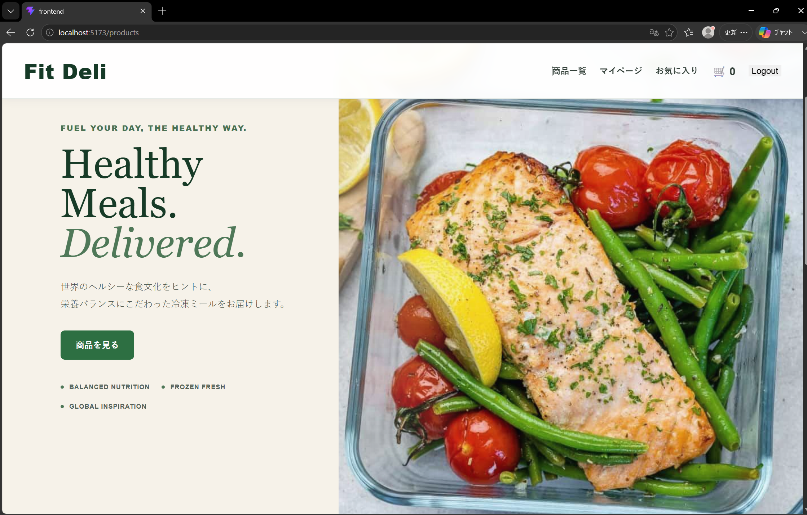
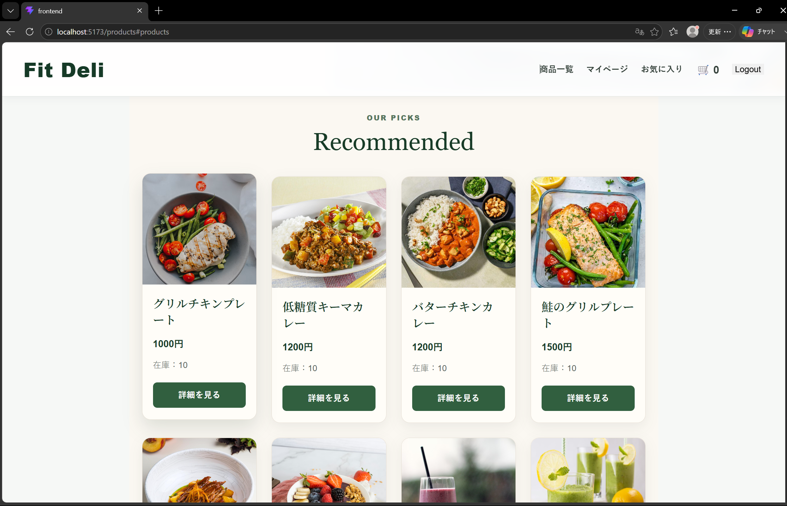
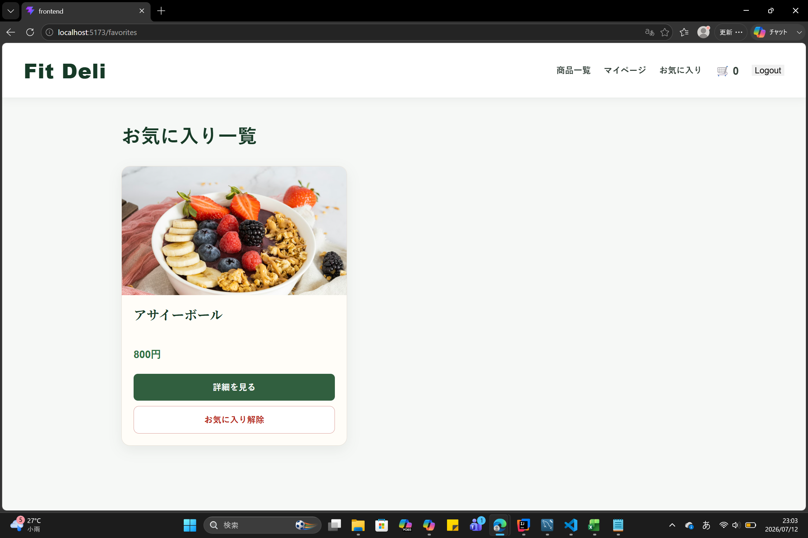
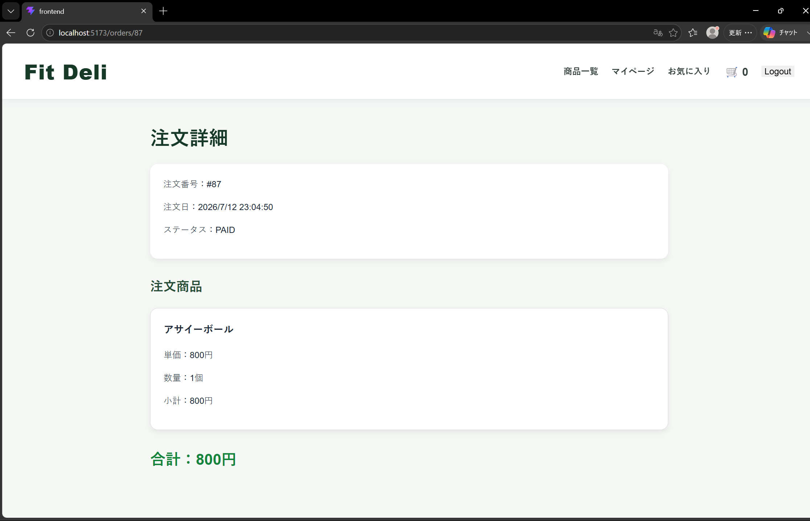

# Fit Deli

健康志向ユーザー向けの冷凍宅配弁当ECサイトです。

Spring Boot + React + Stripeを使用し、
商品閲覧から決済、注文履歴管理までを実装しています。


---

## 概要

Fit Deliは、冷凍宅配弁当の商品閲覧から決済、注文履歴の確認までを行えるECサイトです。

もともとSpring BootとThymeleafで構築していた一般ユーザー画面を、React + Viteへ移行しました。

現在は役割ごとに技術を分離しています。

- 一般ユーザー画面：React + Vite
- ログイン画面：Thymeleaf
- 管理画面：Thymeleaf
- バックエンド：Spring Boot REST API
- 決済：Stripe Checkout（テストモード）

ReactとSpring Boot間ではREST APIを利用し、Cookieベースで認証状態を共有しています。

---

## Demo

- GitHub  
  https://github.com/YOSHI110YY/ec-mini

- 公開環境  
  https://ec-mini-production.up.railway.app/

> Railwayの無料トライアル終了に伴い、現在は公開環境を停止しています。  
> ローカル環境では、React画面・管理画面・Stripeテスト決済を含む一連の動作を確認できます。

---

## テストアカウント

### 一般ユーザー

```text
ID: testuser
PASS: password
```

### 管理者

```text
ID: admin
PASS: password
```

---

## 主な機能

### 一般ユーザー

- ログイン・ログアウト
- 商品一覧表示
- カテゴリによる商品絞り込み
- 商品詳細表示
- お気に入り追加・解除
- お気に入り一覧表示
- カート追加
- カート数量変更
- カート商品削除
- 注文内容確認
- Stripe Checkoutによるテスト決済
- 注文完了
- 注文完了後のカート初期化
- 注文履歴表示
- 注文詳細表示
- マイメニュー表示

### 管理者

- 管理者ログイン
- 管理ダッシュボード表示
- 商品一覧表示
- 商品登録
- 商品編集
- 商品削除
- 在庫数管理
- 注文一覧表示
- 注文詳細表示
- 注文ステータス更新

---

## システム構成

```text
Browser
  │
  ├─ React + Vite
  │    ├─ 商品一覧
  │    ├─ 商品詳細
  │    ├─ お気に入り
  │    ├─ カート
  │    ├─ 注文確認
  │    ├─ 注文完了
  │    └─ 注文履歴・注文詳細
  │
  └─ Thymeleaf
       ├─ ログイン
       └─ 管理画面
              │
              ▼
       Spring Boot
       ├─ REST API
       ├─ Spring Security
       ├─ Service
       ├─ Repository
       └─ Stripe Checkout
              │
              ▼
            MySQL
```

---

## 使用技術

### Backend

- Java 17
- Spring Boot 3
- Spring Security
- Spring Data JPA
- Bean Validation
- Maven

### Frontend

- React
- Vite
- JavaScript
- React Router
- HTML
- CSS
- Thymeleaf
- Bootstrap 5

### Database

- MySQL 8

### Payment

- Stripe Checkout

### Infrastructure / Tools

- Docker
- Docker Compose
- Railway
- GitHub Actions
- Git
- GitHub

### Testing

- JUnit 5
- Mockito
- MockMvc

---

## React移行

一般ユーザー向け画面を、Spring BootのThymeleafテンプレートからReact + Viteへ移行しました。

### 移行対象

- 商品一覧
- 商品詳細
- お気に入り
- カート
- 注文確認
- 注文完了
- 注文履歴・注文詳細
- マイページ

### 継続利用している機能

- ログイン画面（Thymeleaf）
- 管理画面（Thymeleaf）
- Spring Security認証

既存の認証・管理機能は維持しつつ、一般ユーザー向け画面のみをSPA化しています。

---

## REST API連携

ReactからSpring Boot REST APIを利用して、商品・お気に入り・カート・注文情報を取得・更新しています。

認証状態はCookieを利用して共有しています。

```javascript
fetch("http://localhost:8080/api/...", {
  credentials: "include"
});
```

---

## Stripeテスト決済

Stripe Checkoutのテストモードを使用しています。

### 環境変数

```text
STRIPE_SECRET_KEY=sk_test_xxxxxxxxxxxxxxxxx
```

### テストカード

```text
カード番号: 4242 4242 4242 4242
有効期限: 任意の未来日
CVC: 任意の3桁
メールアドレス: 任意
```

### 決済処理

1. Reactの注文確認画面からSpring Bootへリクエスト
2. Spring BootがStripe Checkoutセッションを作成
3. Stripe Checkout画面へ遷移
4. テスト決済を実行
5. 注文データを登録
6. 注文完了画面を表示
7. カート内容を初期化
8. 注文履歴へ反映

> 本アプリは学習用ポートフォリオのため、決済成功後のリダイレクト処理を利用して注文を確定しています。実運用ではStripe Webhookを使用した注文確定が適しています。

---

## 例外処理

- `StockException`
- `OrderException`
- `PaymentException`

`GlobalExceptionHandler`を利用し、アプリケーション全体の例外処理を共通化しています。

---

## ローカル起動方法

### 必要環境

- Java 17
- Maven
- Node.js
- npm
- MySQL 8
- Stripeテスト用シークレットキー

### 1. リポジトリを取得

```bash
git clone https://github.com/YOSHI110YY/ec-mini.git
cd ec-mini
```

### 2. MySQLを起動

```bash
docker compose up -d
```

### 3. Stripe環境変数を設定

#### PowerShell

```powershell
$env:STRIPE_SECRET_KEY="sk_test_xxxxxxxxxxxxxxxxx"
```

#### コマンドプロンプト

```cmd
set STRIPE_SECRET_KEY=sk_test_xxxxxxxxxxxxxxxxx
```

### 4. Spring Bootを起動

```bash
mvn spring-boot:run
```

### 5. Reactを起動

```bash
cd frontend
npm install
npm run dev
```

### 6. ログイン

```text
http://localhost:8080/login
```

一般ユーザー：
```text
http://localhost:5173
```

管理者：
```text
http://localhost:8080/admin
```

---

## Docker

```bash
docker compose up -d
```

停止：

```bash
docker compose down
```

---

## テスト

JUnit 5、Mockito、MockMvcを使用しています。

### 主なテスト対象

- ProductService
- CartService
- OrderService
- FavoriteService
- ProductController
- CartController
- OrderController
- AdminProductController

### 実行

```bash
mvn test
```

---

## CI

GitHub Actionsを使用し、pushおよびpull request時にMavenテストを実行しています。

```text
mvn test
```

---

## 画面イメージ

### トップページ


### 商品一覧


### 商品詳細


### お気に入り


### カート


### 注文完了


### 注文履歴


### 管理画面


---

## 設計・実装で意識した点

- ReactとSpring Bootの役割分離
- REST APIを利用したフロントエンド・バックエンド連携
- Controller、Service、Repositoryの責務分離
- Spring Securityによる認証・認可
- Cookieを利用したログイン状態の共有
- 独自例外によるエラーの分類
- `GlobalExceptionHandler`による例外処理の共通化
- Stripe処理のService層への分離
- 環境変数による機密情報の管理
- 在庫数を考慮した注文処理
- 注文完了後のカート初期化
- 共通API関数による重複処理の削減
- React Routerを利用した画面遷移
- コンポーネント分割による再利用性の向上

---

## 今後改善したい点

- Stripe Webhookによる注文確定
- AWSなどを利用した再デプロイ
- Reactのコンポーネントテスト追加
- REST APIのテスト強化
- TypeScriptへの移行
- 商品レビュー機能
- 管理画面の検索・絞り込み機能
- レスポンシブ表示のさらなる改善